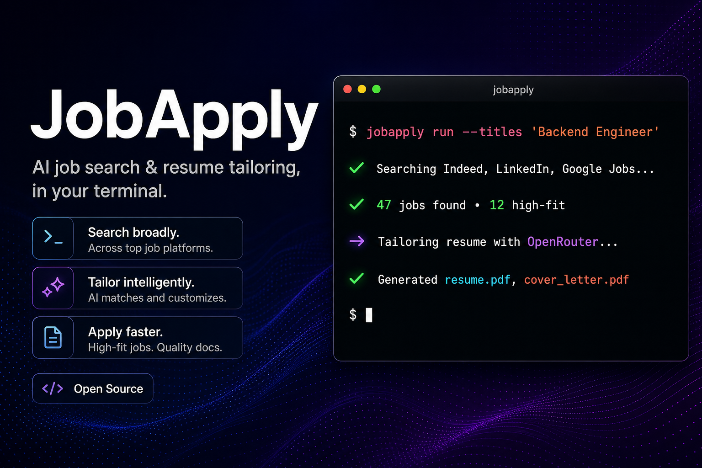
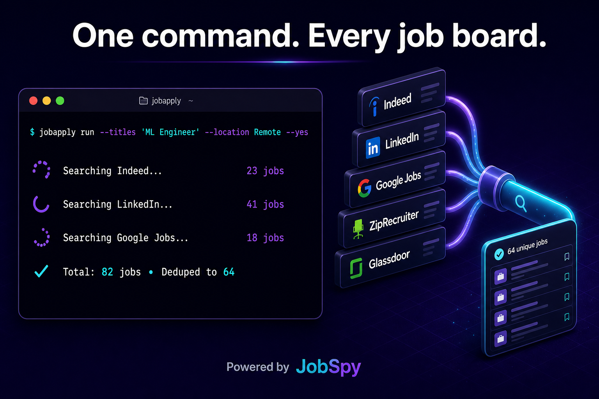
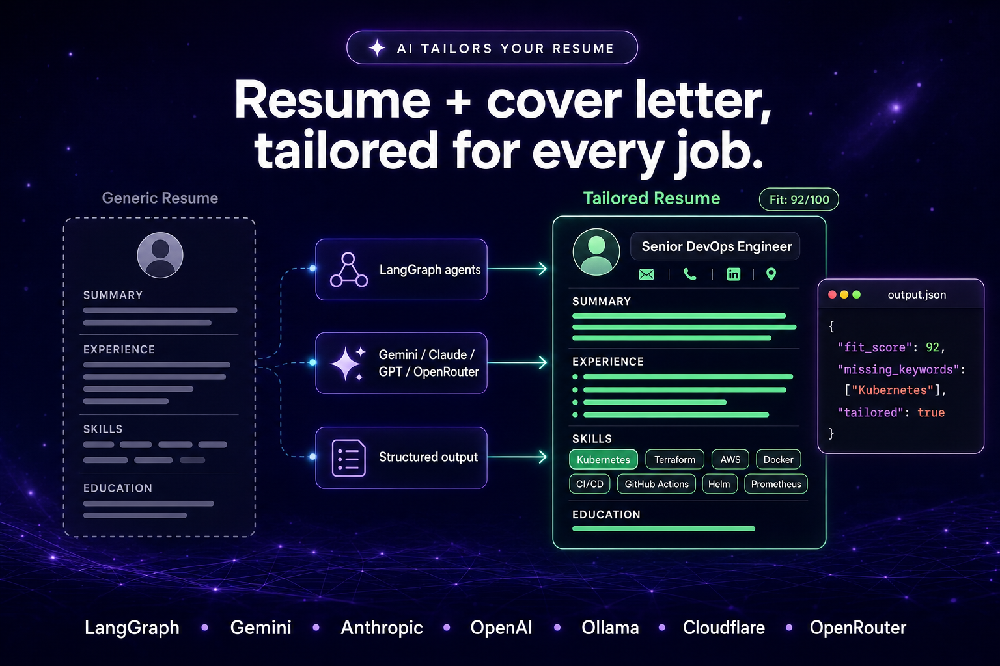
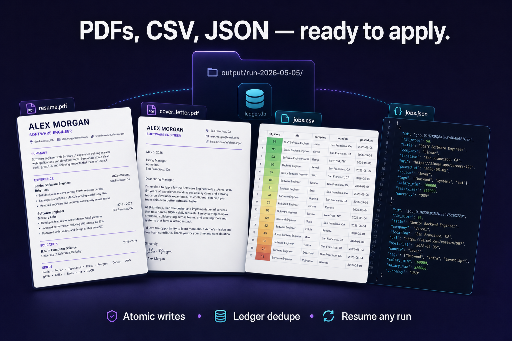

<p align="center">
  
</p>

<h1 align="center">JobApply</h1>

<p align="center">
  <strong>One CLI to search every job board and tailor your resume with AI.</strong><br/>
  Open-source, self-hostable, bring-your-own-LLM.
</p>

<p align="center">
  <a href="https://github.com/arun2728/jobapply/actions/workflows/ci.yml"></a>
  <a href="https://github.com/arun2728/jobapply/blob/main/LICENSE"></a>
  <a href="https://www.python.org/downloads/"></a>
  <a href="https://github.com/arun2728/jobapply/stargazers"></a>
  <a href="https://github.com/arun2728/jobapply/issues"></a>
</p>

<p align="center">
  <a href="#quickstart">Quickstart</a> •
  <a href="#why-jobapply">Why</a> •
  <a href="#how-it-works">How it works</a> •
  <a href="#commands">Commands</a> •
  <a href="#configuration">Config</a> •
  <a href="CONTRIBUTING.md">Contributing</a>
</p>

<p align="center">
  
</p>

---

JobApply collapses the two most painful parts of a job search into a single command:

1. **Find roles that actually match you** — across Indeed, LinkedIn, Google Jobs, ZipRecruiter, and Glassdoor (via [JobSpy](https://github.com/speedyapply/python-jobspy)).
2. **Tailor your resume + cover letter for every match** — via a [LangGraph](https://github.com/langchain-ai/langgraph) pipeline that scores fit and rewrites your documents using **Gemini**, **Anthropic**, **OpenAI** (or any OpenAI-compatible gateway), **Ollama**, **Cloudflare Workers AI**, or **OpenRouter** (one key, hundreds of models).

```bash
jobapply run --titles "Backend Engineer,ML Engineer" --location "Remote" --yes
```

Everything runs locally. Your resume never leaves your machine unless you tell it to.

<p align="center">
  
</p>

## Why JobApply

| Pain | What people usually do | What JobApply does |
|---|---|---|
| Job boards are fragmented | Tabs across 5 sites, copy-pasting filters | One CLI hits them all in parallel and dedupes |
| Resumes need tailoring per role | "I'll just send the same PDF" → 0.3% reply rate | Per-role resume + cover letter, scored for fit |
| Tailoring with ChatGPT is tedious | 50 prompts, 50 copy-pastes | Structured `profile.json` → structured outputs → atomic writes |
| Tools are SaaS black boxes | Pay $30/mo to upload your resume to a stranger's server | MIT-licensed, self-hostable, bring-your-own-LLM |
| Nothing survives a crash | Re-run, re-pay for the same tokens | SQLite ledger + checkpointed graph; resumes are idempotent |

<p align="center">
  
</p>

## How it works

JobApply is a `StateGraph` that walks a queue of jobs through scoring, tailoring, and rendering — checkpointed at every step so a crash never costs you a token.

```text
search → dedupe → ┌─ process_one ─┐
                  │ score fit     │
                  │ tailor resume │
                  │ cover letter  │
                  │ render PDFs   │
                  └───────────────┘   loop until queue is empty
```

Outputs per run:

- `output/run-<timestamp>/jobs.json` — master index + embedded tailored content
- `output/run-<timestamp>/jobs.csv` — Google-Sheets-friendly summary (one row per job, sorted by status + fit score)
- `output/run-<timestamp>/jobs/<slug>/` — `job.json`, `resume.md`, `resume.tex`, `resume.pdf`, `cover_letter.md`, `cover_letter.tex`, `cover_letter.pdf`

<p align="center">
  
</p>

PDFs are always produced. Markdown PDFs go through a three-tier fallback (`pandoc` → `weasyprint` → `fpdf2`); install pandoc or `pango` for nicer output. The styled LaTeX PDFs (`resume.pdf`, `cover_letter.pdf` rendered from the bundled LaTeX templates) are compiled via a remote [`latex-on-http`](https://github.com/YtoTech/latex-on-http) service by default, so no local TeX install is required — `tectonic` / `pdflatex` are still used as fallbacks if the API is disabled or unreachable.

**Deduping & resume**

- Workspace-local ledger at `./.jobapply/ledger.db` (gitignored) skips jobs already completed for the same `profile.json` hash. Override with `ledger_path = "..."` in `jobapply.toml` if you want a shared/global ledger.
- Re-runs that hit the ledger emit a `cached` `JobRecord` into `jobs.json` so the run dir is never empty. Pass `--force` to ignore the ledger and re-process everything.
- Each run stores `meta.json` (search snapshot). `jobapply resume run-...` skips network search and rebuilds the work queue from `meta.json` + ledger (by default removes `checkpoint.sqlite` so processing restarts cleanly after failures).

## Demo

<p align="center">
  
</p>

<p align="center">
  <sub>
    Higher quality:
    <a href="assets/demo.mp4">MP4</a> ·
    <a href="assets/demo.webm">WebM</a> ·
    Source: <a href="assets/demo.tape">demo.tape</a>
  </sub>
</p>


## Quickstart

```bash
python -m venv .venv && source .venv/bin/activate
pip install -e ".[dev]"

# Interactive setup. A resume is mandatory: pass --resume PATH or paste it in.
jobapply init --resume ~/Downloads/resume.pdf   # .md / .txt / .docx / .pdf
# Or paste resume text directly when you don't have a file:
# jobapply init --paste

jobapply run --titles "Backend Engineer,ML Engineer" --skills "Python,Kubernetes" --location "Remote" --yes
```

`jobapply init` writes `jobapply.toml` and a structured `profile.json` extracted from your resume by the configured LLM. The setup wizard lets you tick off **as many providers as you want** in one go (Gemini + OpenAI + Cloudflare, say) and pick which one is the default — every other provider is still configured and ready for `--provider <name>` at runtime. Open `profile.json` to fine-tune any field (name/email/links, experience bullets, skills, education entries with GPA & coursework, projects, etc.) — every key in the [`Profile` schema](jobapply/profile.py) maps 1:1 to what the resume tailor sees. Use `jobapply config` later to add/remove providers or change credentials, or `jobapply config --show` to print the resolved config.

> Heads-up: `jobapply init` always calls your configured LLM to populate `profile.json`. Make sure the **default** provider's API key works (or run an Ollama server locally) before invoking it. There is no Markdown fallback — the JSON is the source of truth.

### `profile.json` schema

The full Pydantic schema lives in [`jobapply/profile.py`](jobapply/profile.py). At a glance:

```jsonc
{
  "name": "Jane Doe",
  "email": "jane@example.com",
  "phone": "+1 555 123 4567",
  "location": "San Francisco, CA",

  "portfolio": "https://jane.dev",
  "github": "janedev",                  // bare handle or full URL
  "linkedin": "https://linkedin.com/in/janedev",
  "medium": "",
  "twitter": "",
  "other_links": [
    { "label": "Dev.to", "url": "https://dev.to/janedev" }
  ],

  "summary": "Engineer with 5 yoe in distributed systems.",
  "skills": ["Python", "Kubernetes", "Model Context Protocol (MCP)"],

  "experience": [
    {
      "company": "Acme",
      "role": "Senior Engineer",
      "location": "Remote",
      "start_date": "2024",
      "end_date": "Present",
      "bullets": ["Cut p99 latency 4×", "Led migration to gRPC"]
    }
  ],

  "projects": [
    {
      "name": "openai-tools",
      "description": "Tiny CLI for OpenAI function calling.",
      "url": "https://github.com/janedev/openai-tools",
      "tech": ["Python", "Click"],
      "bullets": ["1.2k stars", "Used by Acme internally"]
    }
  ],

  "education": [
    {
      "school": "MIT",
      "degree": "B.S. CS",
      "start_date": "2018",
      "end_date": "2022",
      "gpa": "3.85/4.0",
      "coursework": ["Operating Systems", "Machine Learning"],
      "honors": "Dean's list"
    }
  ]
}
```

Empty list / empty string fields are allowed; the CLI prints required-vs-recommended warnings (`name`, `email`, `experience`, `education` are required) but never blocks the run.

### Configuration

`jobapply.toml` holds the **active** provider plus a `[providers.<name>]` block for every provider you've configured. You can keep credentials for several providers side-by-side and flip between them per command via `--provider` (see [Switching providers per run](#switching-providers-per-run)). Every secret accepts an indirection: `api_key = "env:OPENAI_API_KEY"` reads the value from the environment at runtime instead of storing it in the file. See [`jobapply.toml.example`](jobapply.toml.example) for a fully documented template covering all six providers.

| Provider | Required keys | Notes |
|----------|---------------|-------|
| `gemini` | `api_key` (or `GOOGLE_API_KEY` / `GEMINI_API_KEY` env) | |
| `anthropic` | `api_key` (or `ANTHROPIC_API_KEY` env) | optional `base_url` |
| `openai` | `api_key` (or `OPENAI_API_KEY` env) | `base_url` for OpenAI-compatible gateways (Azure, Together, Groq, …); set `max_tokens` if your gateway truncates structured outputs |
| `ollama` | none | local; configure `base_url` (default `http://127.0.0.1:11434`) |
| `cloudflare` | `api_key` (Workers AI token, or `CLOUDFLARE_API_TOKEN` env) **and** `account_id` (or `CLOUDFLARE_ACCOUNT_ID` env) | Two routing modes — see below. `max_tokens` defaults to 4096 to dodge Workers AI's tiny 256-token cap. |
| `openrouter` | `api_key` (or `OPENROUTER_API_KEY` env) | One key, hundreds of models from many vendors. `model` uses `vendor/model` ids (e.g. `openai/gpt-4o-mini`, `anthropic/claude-3-5-sonnet`, `meta-llama/llama-3.3-70b-instruct`). Browse the catalog at [openrouter.ai/models](https://openrouter.ai/models). |

#### Cloudflare routing modes

`jobapply` supports both Cloudflare entry points; pick one by deciding whether to set `gateway_id` (or `CLOUDFLARE_AI_GATEWAY_ID`).

| Mode | When to use | `model` format | Example |
|------|-------------|----------------|---------|
| Direct Workers AI (`gateway_id` **unset**) | Calling Cloudflare's natively hosted models | `@cf/<vendor>/<name>` — see [Workers AI models](https://developers.cloudflare.com/workers-ai/models/) | `@cf/openai/gpt-oss-120b` |
| AI Gateway Unified API (`gateway_id` **set**) | Calling third-party models via BYOK keys you've configured in the gateway's [Stored Keys](https://developers.cloudflare.com/ai-gateway/configuration/bring-your-own-keys/) | `<provider>/<model>` — see the [Unified API docs](https://developers.cloudflare.com/ai-gateway/usage/chat-completion/) | `openai/gpt-5`, `anthropic/claude-3-5-sonnet`, `workers-ai/@cf/meta/llama-3.3-70b-instruct-fp8-fast` |

> If you hit `AiError: No such model: ... openai/gpt-5` on the direct endpoint, you're in mode 1 — either switch the model to a `@cf/...` id, or create an AI Gateway, store your OpenAI key under "Stored Keys", and set `gateway_id` to switch to mode 2.

#### Avoiding Workers AI's 256-token truncation (`max_tokens`)

Cloudflare's OpenAI-compatible Workers AI endpoint defaults `max_tokens` to **256** per request, which is small enough that a tailored resume's structured-output JSON gets truncated mid-payload and the OpenAI SDK raises:

```text
LengthFinishReasonError: Could not parse response content as the length limit
was reached - CompletionUsage(completion_tokens=256, ...)
```

`jobapply` works around this by passing an explicit `max_tokens=4096` whenever the active provider is `cloudflare`, so the bundled resume-tailor / cover-letter / email-drafter agents Just Work. If your resume is unusually long (lots of skills + bullets) and you still see truncation, bump it in `jobapply.toml`:

```toml
[providers.cloudflare]
api_key    = "env:CLOUDFLARE_API_TOKEN"
account_id = "env:CLOUDFLARE_ACCOUNT_ID"
model      = "@cf/openai/gpt-oss-120b"
max_tokens = 8192   # default is 4096; raise if structured outputs get cut off
```

The same `max_tokens` field is available on every provider block — useful for OpenAI-compatible gateways (Together, Groq, Azure, …) that ship with similarly aggressive defaults. Native OpenAI / Anthropic / Gemini endpoints already have generous defaults, so leaving the field unset is the right call there.

#### Picking a Cloudflare model

Workers AI exposes ~80 models; only the ones marked **Function calling** (i.e. supporting structured/tool-call output) work with `jobapply`'s agents. Practical picks:

| Use case | Model id | Notes |
|----------|----------|-------|
| Best default (this repo's default) | `@cf/openai/gpt-oss-120b` | OpenAI's 120B open-weight, "high reasoning, agentic tasks". Most reliable for the strict resume-tailor system prompt. |
| Best price/performance | `@cf/meta/llama-3.3-70b-instruct-fp8-fast` | fp8-quantized 70B with function calling and JSON mode. Significantly cheaper/faster than the 120B tiers. |
| Frontier alternative | `@cf/moonshotai/kimi-k2.6` | 1T params, 262K context, explicit "structured outputs" support. Use for top-quality cover letters / emails when cost isn't a concern. |
| BYOK SOTA (gateway mode) | `openai/gpt-5` or `anthropic/claude-4.5-sonnet` | Set `gateway_id` and store your provider key in AI Gateway → BYOK. Best subjective quality for the email/cover-letter voice. |

Avoid models flagged "Planned deprecation" (e.g. `@cf/meta/llama-3.1-70b-instruct`), code-tuned models like `qwen2.5-coder-32b-instruct` (wrong domain), and anything **without** a Function calling badge — `with_structured_output` will silently misbehave on those.

`jobapply.toml` is gitignored by default. If you prefer env-only secrets, copy `.env.example` to `.env` and leave `api_key` lines commented out (or use `env:VAR_NAME`).

#### Switching providers per run

You don't have to commit to one LLM. Configure as many providers as you want in `jobapply.toml`:

```toml
provider = "openai"   # default when no --provider flag is passed

[providers.openai]
api_key = "env:OPENAI_API_KEY"
model   = "gpt-4o-mini"

[providers.anthropic]
api_key = "env:ANTHROPIC_API_KEY"
model   = "claude-3-5-haiku-latest"

[providers.cloudflare]
api_key    = "env:CLOUDFLARE_API_TOKEN"
account_id = "env:CLOUDFLARE_ACCOUNT_ID"
model      = "@cf/openai/gpt-oss-120b"

[providers.openrouter]
api_key = "env:OPENROUTER_API_KEY"
model   = "openai/gpt-4o-mini"   # or any other vendor/model from openrouter.ai/models
```

Then pick a provider (and optionally a model) at the command line. `--provider` / `--model` win over the TOML defaults; both `jobapply run` and `jobapply tailor` accept them:

```bash
# Use the default (provider = "openai" in the toml above).
jobapply run --titles "Backend Engineer" --yes

# Same run, but route through Anthropic for this invocation.
jobapply run --titles "Backend Engineer" --provider anthropic --yes

# Override both — handy for trying a beefier model ad-hoc.
jobapply tailor --job ~/jds/acme.pdf --provider openai --model gpt-4o

# Drop --yes for an interactive picker of your configured providers
# (and a prompt for the model, prefilled with the provider's default).
jobapply run --titles "Backend Engineer"
```

The runtime picker only lists providers actually configured in `jobapply.toml`, so you won't accidentally pick a provider you have no credentials for.

### PDF rendering

Resumes and cover letters are always exported as PDFs through two independent pipelines. The CLI prints which backend each one will use at run start:

```text
Markdown PDF backend: weasyprint (good)
LaTeX PDF backend:    latex-on-http (https://latex.ytotech.com/builds/sync)
```

#### Markdown → PDF (always available)

Markdown copies of the resume and cover letter (`resume.md`, `cover_letter.md`) are rendered with a three-tier fallback. Tiers 2 and 3 ship with the package, so PDFs work out of the box.

| Tier | Backend | Quality | Install |
|------|---------|---------|---------|
| 1 | [Pandoc](https://pandoc.org/) (+ a TeX engine) | best | `brew install pandoc` (+ MacTeX/Tectonic) |
| 2 | [WeasyPrint](https://weasyprint.org/) | good HTML/CSS | `brew install pango` (Python deps installed automatically) |
| 3 | [`fpdf2`](https://py-pdf.github.io/fpdf2/) | basic, pure Python | bundled — always works |

#### LaTeX → PDF (no local TeX needed)

The styled MTeck-themed LaTeX templates (`resume.tex`, `cover_letter.tex`) are compiled to PDF via a [`latex-on-http`](https://github.com/YtoTech/latex-on-http) HTTP API. By default `jobapply` POSTs the `.tex` content to the public instance at `latex.ytotech.com` and writes the returned PDF — **no Tectonic, MacTeX, or `pdflatex` install required**. Local engines are still tried as fallbacks.

| Tier | Backend | Notes |
|------|---------|-------|
| 1 | [`latex-on-http`](https://github.com/YtoTech/latex-on-http) (remote) | Default. Configurable in `[latex_api]`; supports self-hosting (see below). |
| 2 | [Tectonic](https://tectonic-typesetting.github.io/) | Used when API is disabled / unreachable. Auto-fetches missing TeX packages. |
| 3 | `pdflatex` | Last-resort fallback (full TeX Live install). |

Configure the LaTeX-PDF backend in `jobapply.toml`:

```toml
[latex_api]
enabled  = true
url      = "https://latex.ytotech.com/builds/sync"
compiler = "pdflatex"   # pdflatex | xelatex | lualatex | latexmk
timeout  = 120.0
```

Each setting can also be overridden at runtime via env vars: `JOBAPPLY_LATEX_API_URL`, `JOBAPPLY_LATEX_API_DISABLE`, `JOBAPPLY_LATEX_API_COMPILER`, `JOBAPPLY_LATEX_API_TIMEOUT` (env wins over TOML so shell overrides are non-destructive).

**Self-host (recommended for privacy / reliability).** Your tailored `.tex` contains personal info; if you'd rather not send it to a third-party server, run the same image yourself:

```bash
docker run -d -p 8080:8080 yotools/latex-on-http
# then in jobapply.toml:
# [latex_api]
# url = "http://localhost:8080/builds/sync"
```

To skip PDF generation entirely, pass `--no-pdf` to `jobapply run` / `jobapply resume`.

### Spreadsheet export

After every run, `jobapply` writes `output/run-<id>/jobs.csv` with one row per job — title, company, status, fit score, missing keywords, apply URL, and absolute paths to every generated artifact (resume MD/PDF/TeX, cover letter MD/PDF/TeX). Rows are sorted **done → cached → skipped → failed** with the highest-fit jobs at the top, so importing into Google Sheets via **File → Import → Upload** surfaces the most actionable jobs immediately. URL and path columns work directly with `=HYPERLINK(D2, "open")` formulas.

## Commands

| Command | Description |
|---------|-------------|
| `jobapply init` | Interactive setup: pick **one or more** providers, fill in connection details, and import your resume into a structured `profile.json`. **A resume is required**: pass `--resume <path>` (`.md` / `.txt` / `.docx` / `.pdf`, including LinkedIn PDF export) or `--paste` (read text from stdin / multiline prompt). The default provider's LLM extracts the resume into the [`Profile` schema](jobapply/profile.py) via structured output, so make sure that provider's key is reachable before running it. `--non-interactive` skips provider prompts but still requires `--resume` or `--paste`. |
| `jobapply config` | Re-run the multi-provider prompts (add/remove providers, change credentials, or pick a new default); `--show` prints the resolved config |
| `jobapply run` | Full pipeline (prompts unless `--yes`). Use `--provider` / `--model` to override the default LLM for this run — see [Switching providers per run](#switching-providers-per-run). |
| `jobapply search` | **Lightweight cousin of `run`**: fetch jobs into `jobs.{json,csv}` without tailoring resumes. Add `--score` to also score each job against `profile.json`. See [Fetch-only search](#fetch-only-search). |
| `jobapply tailor` | Tailor your resume + cover letter for **one** JD file (skip search). Accepts the same `--provider` / `--model` overrides as `run`. Optional `--with-email` drafts a ready-to-paste application email. See below. |
| `jobapply resume <run-name>` | Continue from `meta.json` (default: reset checkpoint) |
| `jobapply list` | List `output/run-*` folders |

### Fetch-only search

When you just want to triage the market — no resumes, no cover letters, no LLM credentials needed — `jobapply search` runs the same JobSpy fan-out as `jobapply run` and writes a Google-Sheets-friendly `jobs.csv` (plus `jobs.json` for tooling) without touching your profile.

```bash
# Pure fetch — no LLM credentials needed.
jobapply search --titles "Backend Engineer,ML Engineer" --location "Remote" --yes

# Same query, but also score each job against your profile.json.
# --provider / --model are optional; defaults come from jobapply.toml.
jobapply search \
  --titles "Backend Engineer" \
  --location "Remote" \
  --score \
  --provider openrouter \
  --model openai/gpt-4o-mini \
  --yes
```

Flags worth knowing:

| Flag | Description |
|------|-------------|
| `--titles` / `-t` | Comma-separated job titles. Required. |
| `--skills` / `-s` | Comma-separated skills. Boost the search query and (with `--score`) bias the fit-scorer toward what you care about. |
| `--location` / `-l`, `--remote` | Same semantics as `jobapply run`. |
| `--results` / `-n` | Override `results_wanted` from `jobapply.toml`. |
| `--sites` | Comma-separated JobSpy sites (`indeed,linkedin,google,ziprecruiter,glassdoor`). Defaults to `sites` from the toml. |
| `--score` | Run the LLM fit scorer against `profile.json` and write `fit_score`/`fit_rationale`/`missing_keywords` columns. Off by default. |
| `--provider` / `--model` | Pick the LLM for scoring. Optional — defaults to the active provider in `jobapply.toml`. Only used with `--score`. |
| `--profile` | Override `profile_path` from the toml. Only used with `--score`. |
| `--output-dir` / `-o` | Override `output_dir`. Artifacts land in `<output_dir>/search-<timestamp>/`. |
| `--yes` / `-y` | Skip the interactive title/skills/location/provider prompts. |

Output layout:

```text
output/search-<timestamp>/
├── jobs.json   # full JobsIndex (every fetched job + optional FitScore)
├── jobs.csv    # Google-Sheets-friendly summary, sorted by descending fit
└── meta.json   # search input snapshot + provider/model used
```

The CSV always carries `title`, `company`, `location`, `site`, `url`, `apply_url`, and `description` columns; with `--score` you also get `fit_score`, `fit_rationale`, and `missing_keywords`. Rows are sorted by descending fit score so the most promising matches surface at the top when you import into Google Sheets via **File → Import → Upload**. The CLI prints a "Top 5 matches" table inline too, so you can eyeball the best candidates without leaving the terminal.

> Without `--score`, no LLM is called — `jobapply search` works without provider credentials or a `profile.json`. This is the right command to run when you just want to see what's out there.

### `jobapply tailor` — single-JD mode

When you already know which role you want to apply to, `jobapply tailor` skips the search / dedupe / ledger machinery and tailors your resume + cover letter directly against a job-description file you supply. Add `--with-email` to also produce a ready-to-paste application email.

```bash
# Resume + cover letter only.
jobapply tailor --job ~/jds/acme-backend.pdf

# Resume + cover letter + drafted email (recipient + extra context).
jobapply tailor \
  --job ~/jds/acme-backend.pdf \
  --with-email \
  --email-to recruiter@acme.com \
  --email-context "Referred by Bob — available to start in two weeks."
```

Flags worth knowing:

| Flag | Description |
|------|-------------|
| `--job` / `-j` | Path to the job description (`.md` / `.txt` / `.docx` / `.pdf`). Required. |
| `--title` / `--company` / `--location` | Skip LLM JD-metadata extraction by forcing these values. |
| `--skills` / `-s` | Comma-separated skills to bias the tailor towards (in addition to the JD content). |
| `--profile` | Override `profile_path` from `jobapply.toml` (must point at `profile.json`). |
| `--output-dir` / `-o` | Override `output_dir`. Artifacts land in `<output_dir>/tailor-<timestamp>/<slug>/`. |
| `--no-pdf` | Skip the markdown-PDF + LaTeX-PDF pipelines (only `.md` / `.tex` are written). |
| `--with-email` | Also draft an application email. Requires `--email-to` (or use the interactive prompt). |
| `--email-to` | Recipient email address for the drafted email. |
| `--email-context` | Optional free-form context the model weaves in (referrals, availability, prior contact). |
| `--provider` / `--model` | Override provider / model from `jobapply.toml` for this tailor run. See [Switching providers per run](#switching-providers-per-run). |

Output layout (mirrors `jobapply run`'s per-job folder so the same PDF backends apply):

```text
output/tailor-<timestamp>/<slug>/
├── resume.md
├── resume.tex
├── resume.pdf              # markdown -> PDF (pandoc / weasyprint / fpdf2)
├── resume-latex.pdf        # styled LaTeX template (latex-on-http / tectonic / pdflatex)
├── cover_letter.md
├── cover_letter.tex
├── cover_letter.pdf
├── cover_letter-latex.pdf
├── tailor_meta.json        # JD source + parsed title/company/location
└── email.txt               # only when --with-email; To / Subject / body, ready to paste
```

## Architecture

- **LangGraph** `StateGraph`: `search` → `dedupe` → `process_one` (loop until queue empty)
- **SqliteSaver** checkpoint: `output/<run>/checkpoint.sqlite`
- **Agents**: fit scorer, resume tailor, cover letter, optional networking — all `with_structured_output(Pydantic)`
- **Inspiration**: multi-agent patterns from community writeups; production guardrails = structured outputs + ledger + atomic JSON writes

## Roadmap

Things on the table — open a [Discussion](https://github.com/arun2728/jobapply/discussions) or upvote an issue to nudge any of them forward.

- [ ] DOCX export (alongside Markdown + PDF)
- [ ] Locale-specific templates (EU CV, JP rirekisho, indented academic CV)
- [ ] Browser-extension companion for one-click "Apply with this PDF"
- [ ] Application-tracker integrations (Notion, Huntr, Teal)
- [ ] Optional Postgres backend for the ledger (multi-machine workflows)
- [ ] First-class support for Bedrock / Vertex AI / Azure OpenAI as providers
- [ ] `jobapply tui` — a Textual UI for browsing tailored runs

## Contributing

See [CONTRIBUTING.md](CONTRIBUTING.md). Good first issues are tagged
[`good first issue`](https://github.com/arun2728/jobapply/labels/good%20first%20issue),
and substantive feature work lives under
[`help wanted`](https://github.com/arun2728/jobapply/labels/help%20wanted).

By participating in this project you agree to abide by our
[Code of Conduct](CODE_OF_CONDUCT.md). To report a security issue, see
[SECURITY.md](SECURITY.md).

## Acknowledgements

- [JobSpy](https://github.com/speedyapply/python-jobspy) — the unsung hero that makes "every job board, one query" possible.
- [LangGraph](https://github.com/langchain-ai/langgraph) — checkpointable agent graphs without the framework tax.
- [latex-on-http](https://github.com/YtoTech/latex-on-http) — clean LaTeX→PDF as a service, self-hostable in a single Docker container.
- [Charm VHS](https://github.com/charmbracelet/vhs) — used to record the terminal demo.
- Bundled LaTeX templates:
  - `jobapply/templates/resume.tex` — adapted from Michael Lustfield's MTeck resume, [CC BY 4.0](https://creativecommons.org/licenses/by/4.0/legalcode.txt).
  - `jobapply/templates/cover_letter.tex` — adapted from Jayesh Sanwal's entry-level cover-letter template (CC BY 4.0).

<!-- ## Star history

<a href="https://www.star-history.com/#arun2728/jobapply&Date">
  
</a> -->

## License

MIT — see [LICENSE](LICENSE). Your `profile.json` content remains yours.

---

<p align="center">
  
  <br/>
  <em>Built with care for everyone who's tired of pasting the same resume into 47 forms.</em>
  <br/>
  If JobApply saved you an afternoon, please <a href="https://github.com/arun2728/jobapply">⭐ the repo</a>.
</p>
